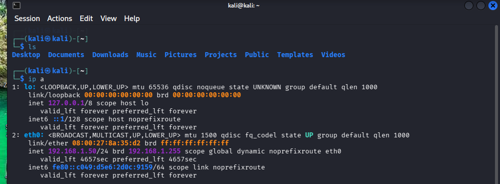
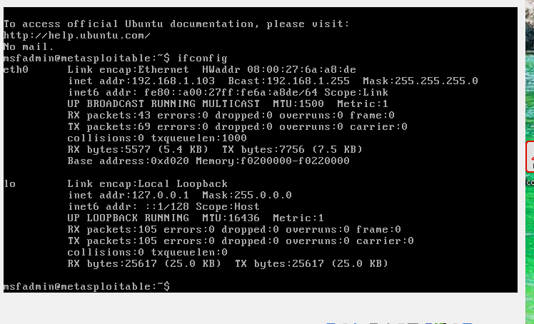
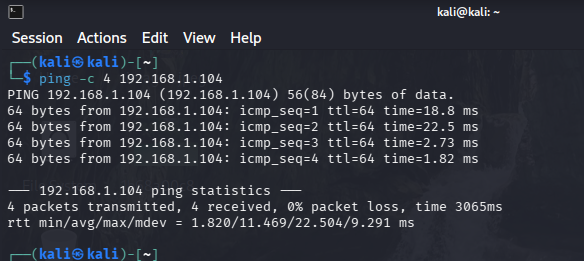

# Reporte de Práctica: Escaneo de Red con Nmap y Metasploitable

**Estudiante:** Manuel  
**Materia:** Ciberseguridad / Pruebas de Penetración  

---

## 1. Introducción
En esta práctica de laboratorio se configuró un entorno controlado de pruebas de penetración utilizando dos máquinas virtuales en VirtualBox:
* **Máquina Atacante:** Kali Linux
* **Máquina Víctima:** Metasploitable 2

El objetivo principal fue identificar la dirección IP de ambos sistemas, verificar la conectividad entre ellos mediante el comando `ping` y realizar un escaneo de puertos y servicios utilizando **Nmap**.

---

## 2. Direcciones IP de los Equipos

Para verificar el direccionamiento de la red local creada en VirtualBox, se ejecutaron los comandos de red en ambas máquinas virtuales.

### IP de Kali Linux
Se ejecutó el comando `ip a` en la terminal de Kali Linux para obtener su dirección IP.



### IP de Metasploitable 2
Se inició sesión en la consola de Metasploitable y se ejecutó el comando `ifconfig`.



---

## 3. Pruebas de Conectividad (Ping)
Se realizó una prueba de ICMP Echo Request desde la máquina atacante (Kali Linux) hacia la máquina víctima (Metasploitable) para confirmar que ambas se encuentran en la misma red y tienen conectividad.



**Resultado:** Se obtuvo un 0% de pérdida de paquetes, confirmando la comunicación directa entre ambas máquinas virtuales.

---

## 4. Escaneo de Puertos y Servicios con Nmap
Una vez confirmada la conectividad, se ejecutó un escaneo de detección de versiones y puertos abiertos desde Kali Linux hacia Metasploitable con el siguiente comando:

```bash
nmap -sV <IP_DE_METASPLOITABLE>
