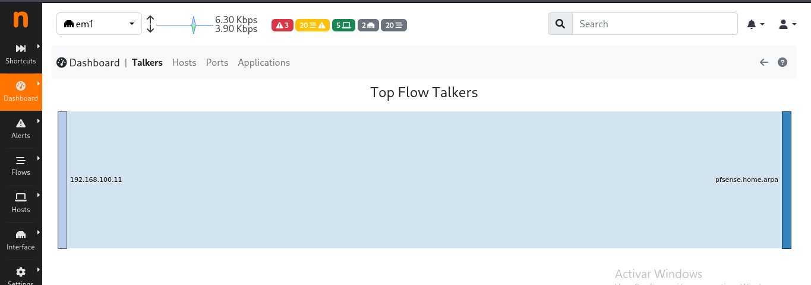
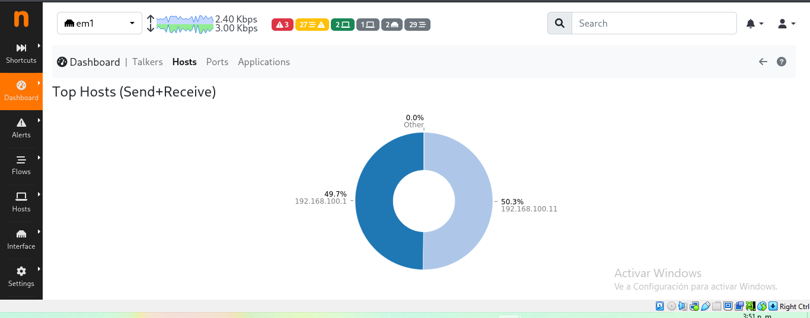
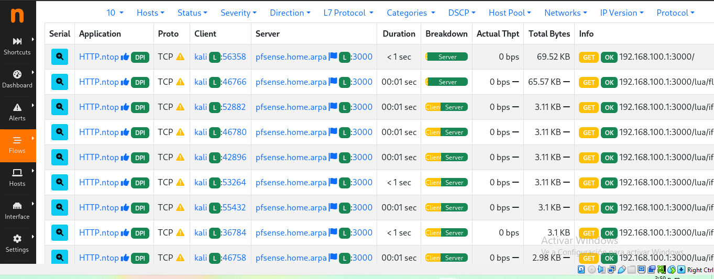

# Práctica de Laboratorio: Monitoreo y Análisis de Tráfico de Red con ntopng y pfSense

## 1. Objetivo de la Práctica
Desplegar y analizar el comportamiento del tráfico de red en tiempo real mediante la sonda de monitoreo **ntopng** integrada en la interfaz **LAN** del firewall **pfSense**, utilizando **Kali Linux** como host dentro del segmento virtualizado.

---

## 2. Información del Entorno
* **Firewall / Gateway:** pfSense (`192.168.100.1`)
* **Host de Pruebas / Auditoría:** Kali Linux (`192.168.100.11`)
* **Servicio de Monitoreo:** ntopng (`Puerto 3000`)
* **Interfaz de Captura:** `em1` (LAN)

---

## 3. Evidencias del Monitoreo y Análisis

### Fase 1: Panel General (Dashboard)
Se verificó el inicio de sesión y la actividad general del tráfico procesado por la sonda ntopng a través del dashboard principal.

---

### Fase 2: Análisis de Consumo por Host (Hosts)
Se generó tráfico desde la máquina Kali Linux (`192.168.100.11`) hacia la interfaz del firewall (`192.168.100.1`). La sonda registró y clasificó la distribución del volumen de tráfico entre los hosts activos.

---

### Fase 3: Captura de Flujos en Tiempo Real (Live Flows)
Se inspeccionaron las sesiones y flujos activos (*Live Flows*), observando la clasificación de protocolos a nivel de capa de aplicación (L7), el estado de las conexiones TCP y el consumo en bytes por sesión.

---

## 4. Conclusión
La implementación de ntopng sobre pfSense otorga visibilidad detallada de Capa 7 (L7) del modelo OSI, permitiendo monitorear el consumo de ancho de banda y analizar la interacción entre los hosts de la red interna de manera precisa.
